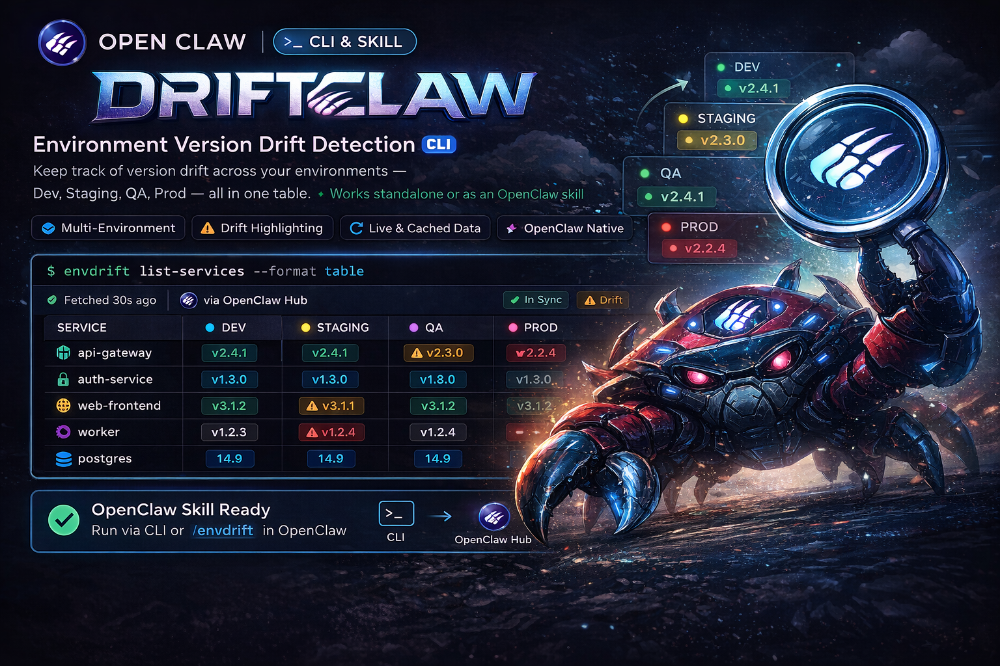

# Driftclaw 🦀

See deployment drift across dev, test, staging, prod, and whatever weird environment names your company invented.

<p align="center">
  
</p>

`driftclaw` answers one question fast: what version is actually running where?

It checks multiple services across multiple environments, pulls version data from the sources you already have, and highlights drift before you waste time clicking through dashboards, docs, health endpoints, and admin panels.

Plain table output is the default for reporting commands. Use `--ink` if you want the Ink/TUI renderer instead.

## Why Driftclaw Exists

Deployment drift is easy to create and annoying to verify.

- One service exposes `/version`
- Another hides version in `openapi.json`
- A WordPress site leaks it through a meta tag
- Environment names do not match across systems
- One team says `prod`, another says `prd`, another says `live`

Driftclaw gives you one command that turns that mess into a clear matrix.

## 10-Second Proof

```bash
pnpm cli
```

```text
┌─────────────┬────────┬────────┬────────┬────────┬───────────────┐
│ Service     │ dev    │ test   │ prod   │ inf    │ Status        │
├─────────────┼────────┼────────┼────────┼────────┼───────────────┤
│ auth-api    │ v2.4.0 │ v2.3.1 │ v2.2.0 │ —      │ ⚠ major drift │
│ billing-api │ 1.8.0  │ 1.8.0  │ 1.8.0  │ 1.8.0  │ ✓ sync        │
│ marketing   │ 6.9.4  │ —      │ 6.9.4  │ 6.9.4  │ ✓ sync        │
└─────────────┴────────┴────────┴────────┴────────┴───────────────┘

Summary: 3 services · 2 sync · 1 drift
```

## Who It Is For

- Platform and DevOps teams that need quick deployment visibility
- Backend teams with multiple APIs across multiple environments
- Agencies and consultants inheriting inconsistent client infrastructure
- Enterprise teams stuck with mixed naming like `dev`, `tst`, `uat`, `inf`, `prd`
- Polyrepo teams where every service exposes version info differently

## Install

```bash
git clone https://github.com/psandis/driftclaw.git
cd driftclaw
pnpm install
pnpm build
```

## Create `driftclaw.yaml`

Create a `driftclaw.yaml` in the directory where you want to run `driftclaw`:

```bash
cp driftclaw.example.yaml driftclaw.yaml
```

Starter example:

```yaml
environments:
  dev:
    url: https://dev.api.example.com
  test:
    url: https://tst.api.example.com
  prod:
    url: https://api.example.com

services:
  app-api:
    source: http
    path: /version
    field: version

  docs-api:
    source: http
    path: /openapi.json
    field: info.version

  website:
    source: html-meta
    field: generator
    environments:
      dev:
        url: https://dev.example.com
      prod:
        url: https://example.com
```

Then run:

```bash
driftclaw
```

- `environments` defines the default environment URLs
- `services` defines what to check and how to extract the version
- service-level `environments` overrides the defaults when a service uses different URLs

## What It Handles Well

- Mixed environment names across services
- Per-service environment overrides
- Multiple version source types in one config
- Semver drift severity: major, minor, patch
- Human output and machine output
- Partial environment coverage with gaps shown as `—`

## CI And Automation

Common commands:

```bash
driftclaw
driftclaw --ink
driftclaw check auth-api
driftclaw drift
```

Use JSON when you want structured output:

```bash
driftclaw --json
driftclaw drift --json
driftclaw check auth-api --json
```

Fail a pipeline only when you want drift to gate delivery:

```bash
driftclaw --fail-on-drift
driftclaw drift --fail-on-drift
```

Drift itself is not treated as a runtime error unless you opt into `--fail-on-drift`.

## Version Sources

| Source | Description |
| --- | --- |
| `http` | GET a JSON endpoint and extract a field |
| `html-meta` | Extract version from HTML `<meta>` tags |
| `git-tag` | Latest tag from a GitHub repo |
| `gitlab-tag` | Latest tag from a GitLab repo |
| `bitbucket-tag` | Latest tag from a Bitbucket repo |
| `docker` | Latest semver-looking tag from Docker Hub |
| `npm` | Latest version from npm registry |
| `custom` | Run any shell command and use stdout |

Notes:

- `http` works with `/version`, `/info`, `/health`, `/status`, `/openapi.json`, or any other JSON endpoint
- dot notation is supported, for example `info.version`
- `html-meta` is useful for WordPress, WooCommerce, and other sites exposing version data in meta tags
- Git sources can use `GITHUB_TOKEN`, `GH_TOKEN`, `GITLAB_TOKEN`, or `BITBUCKET_TOKEN`
- `custom` commands receive `DRIFTCLAW_ENV` and `DRIFTCLAW_SERVICE`

## Notes

- Driftclaw does not enforce environment naming. Use whatever your org already has: `dev`, `test`, `qa`, `uat`, `inf`, `prd`, `live`, region names, or custom names.
- If one service uses different URLs or different environment names than the rest, override them on that service.
- This is a release-verification tool, not a monitoring system.

## Related

- 🦀 [Feedclaw](https://github.com/psandis/feedclaw) - RSS/Atom feed reader and AI digest CLI
- 🦞 [OpenClaw](https://github.com/openclaw/openclaw) - Personal AI assistant

## License

MIT
